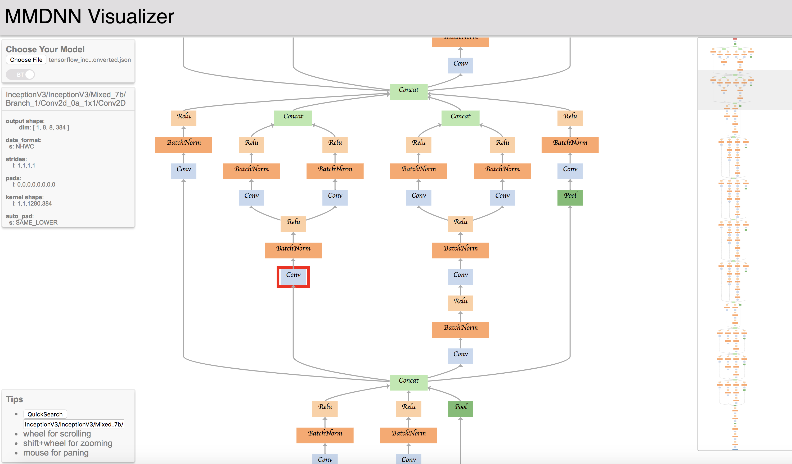

#  MMdnn

[](LICENSE)
[](https://travis-ci.org/Microsoft/MMdnn)

A comprehensive, cross-framework solution to convert, visualize and diagnosis deep neural network models. The "MM" in MMdnn stands for model management and "dnn" is an acronym for deep neural network.

Typically people use deep neural network with following steps:

```
--------------                                               --------------
| Find model | --------------------------------------------> | Deployment |
--------------      |                                        --------------
                    |                                            ^    ^
                    |        --------------                      |    |
                    -------> | Conversion | ----------------------    |
                             --------------                           |
                                   |                                  |
                                   |           -----------            |
                                   ----------> | Retrain | ------------
                                               -----------
```

In MMdnn, we focus on helping user handle their work better.

- **Find model**

  - We provide a [model collection](https://github.com/Microsoft/MMdnn/blob/master/mmdnn/models/README.md) to help you find some popular models.
  - We provide a <a href="#visualization">model visualizer</a> to display the network architecture more intuitively.

- <a href="#conversion">**Conversion**</a>

  - We implement an universal convertor to convert DNN models between frameworks, which means you can train on one framework and deploy on another.

- **Retrain**

  - In convertor, we can generate some training/inference code snippet to simplify the retrain/evaluate work.

- **Deployment**

  - We provide some guidelines to help you deploy your models to other hardware platform.
    - [Android](https://github.com/Microsoft/MMdnn/wiki/Deploy-your-TensorFlow-Lite-Model-in-Android)
    - [Serving](https://github.com/Microsoft/MMdnn/wiki/Tensorflow-Serving-Via-Docker)

This project is designed and developed by [Microsoft Research (MSR)](https://www.microsoft.com/en-us/research/group/systems-research-group-asia/). We also encourage researchers and students leverage this project to analysis DNN models and we welcome any new ideas to extend this project.

## Installation

### Install manually

You can get stable version of MMdnn by

```bash
pip install mmdnn
```

or you can try the newest version by

```bash
pip install -U git+https://github.com/Microsoft/MMdnn.git@master
```

### Install with docker image

MMdnn provides a docker image, which packaged mmdnn, deep learning frameworks we supported and other dependencies in one image. You can easily get the image in several steps:

1. Install Docker Community Edition(CE)

    [_Learn more about how to install docker_](https://github.com/Microsoft/MMdnn/blob/master/docs/InstallDockerCE.md)

1. Pull MMdnn docker image
    ```bash
    docker pull mmdnn/mmdnn:cpu.small
    ```

1. Run image in interactive mode

    ```bash
    docker run -it mmdnn/mmdnn:cpu.small
    ```

## Features

### <a name="conversion">Model Conversion</a>

Across the industry and academia, there are a number of existing frameworks available for developers and researchers to design a model, where each framework has its own network structure definition and saving model format. The gaps between frameworks impede the inter-operation of the models.


We provide a model converter to help developers convert models between frameworks, through an intermediate representation format.

#### Support frameworks

> [Note] You can click the links to get detail README of each framework

- [Caffe](https://github.com/Microsoft/MMdnn/blob/master/mmdnn/conversion/caffe/README.md)
- [Microsoft Cognitive Toolkit (CNTK)](https://github.com/Microsoft/MMdnn/blob/master/mmdnn/conversion/cntk/README.md)
- [CoreML](https://github.com/Microsoft/MMdnn/blob/master/mmdnn/conversion/coreml/README.md)
- [Keras](https://github.com/Microsoft/MMdnn/blob/master/mmdnn/conversion/keras/README.md)
- [MXNet](https://github.com/Microsoft/MMdnn/blob/master/mmdnn/conversion/mxnet/README.md)
- [ONNX](https://github.com/Microsoft/MMdnn/blob/master/mmdnn/conversion/onnx/README.md) (Destination only)
- [PyTorch](https://github.com/Microsoft/MMdnn/blob/master/mmdnn/conversion/pytorch/README.md)
- [Tensorflow](https://github.com/Microsoft/MMdnn/blob/master/mmdnn/conversion/tensorflow/README.md) (Experimental) (Highly recommend you read the README of tensorflow firstly)
- [DarkNet](https://github.com/Microsoft/MMdnn/blob/master/mmdnn/conversion/darknet/README.md) (Source only, Experiment)

#### Tested models

The model conversion between currently supported frameworks is tested on some **ImageNet** models.

Models | Caffe | Keras | Tensorflow | CNTK | MXNet | PyTorch  | CoreML | ONNX
:-----:|:-----:|:-----:|:----------:|:----:|:-----:|:--------:|:------:|:-----:|
[VGG 19](http://arxiv.org/abs/1409.1556.pdf) | √ | √ | √ | √ | √ | √ | √ | √
[Inception V1](http://arxiv.org/abs/1409.4842v1) | √ | √ | √ | √ | √ | √ | √ | √
[Inception V3](http://arxiv.org/abs/1512.00567)  | √ | √ | √ | √ | √ | √ | √ | √
[Inception V4](http://arxiv.org/abs/1512.00567)  | √ | √ | √ | o | √ | √ | √ | √
[ResNet V1](https://arxiv.org/abs/1512.03385)                               |   ×   |   √   |     √      |   o  |   √   |    √ | √ | √
[ResNet V2](https://arxiv.org/abs/1603.05027)                               |   √   |   √   |     √      |   √  |   √   | √ | √ | √
[MobileNet V1](https://arxiv.org/pdf/1704.04861.pdf)                        |   ×   |   √   |     √      |   o  |   √   |    √       | √ | √ | √
[MobileNet V2](https://arxiv.org/pdf/1704.04861.pdf)                        |   ×   |   √   |     √      |   o  |   √   |    √       | √ | √ | √
[Xception](https://arxiv.org/pdf/1610.02357.pdf)                            |   √   |   √   |     √      |   o  |   ×   |    √ | √ | √ | √
[SqueezeNet](https://arxiv.org/pdf/1602.07360)                              |   √   |   √   |     √      |   √  |   √   |    √ | √ | √ | √
[DenseNet](https://arxiv.org/abs/1608.06993)                                |   √   |   √   |     √      |   √  |   √   |    √       | √ | √
[NASNet](https://arxiv.org/abs/1707.07012)                                  |   x   |   √   |     √      |   o  |   √   | √ | √ | x
[ResNext](https://arxiv.org/abs/1611.05431)                                 |   √   |   √   |     √      |   √  |   √   | √ | √ | √ | √ | √
[voc FCN](https://people.eecs.berkeley.edu/~jonlong/long_shelhamer_fcn.pdf) |       |       |     √      |   √  |       |
Yolo3                                                                       |       |   √   |            |   √  |

#### Usage

One command to achieve the conversion. Use a TensorFlow **ResNet V2 152** to PyTorch as our example.

```bash
$ mmdownload -f tensorflow -n resnet_v2_152 -o ./
$ mmconvert -sf tensorflow -in imagenet_resnet_v2_152.ckpt.meta -iw imagenet_resnet_v2_152.ckpt --dstNodeName MMdnn_Output -df pytorch -om tf_resnet_to_pth.pth
```

Done.

#### On-going frameworks

- Torch7 (help wants)
- Chainer (help wants)

#### On-going Models

- Face Detection
- Semantic Segmentation
- Image Style Transfer
- Object Detection
- RNN

---

### <a name="visualization">Model Visualization</a>

You can use the [MMdnn model visualizer](http://vis.mmdnn.com/) and submit your IR json file to visualize your model.  In order to run the commands below, you will need to install [requests](https://anaconda.org/anaconda/requests), [keras](https://anaconda.org/anaconda/keras), and [Tensorflow](https://anaconda.org/anaconda/tensorflow) using your favorite package manager.

Use the [Keras "inception_v3" model](https://github.com/fchollet/deep-learning-models) as an example again.

1. Download the pre-trained models

```bash
$ mmdownload -f keras -n inception_v3
```

2. Convert the pre-trained model files into intermediate representation

```bash
$ mmtoir -f keras -w imagenet_inception_v3.h5 -o keras_inception_v3
```

3. Open the [MMdnn model visualizer](http://mmdnn.eastasia.cloudapp.azure.com:8080/) and choose file *keras_inception_v3.json*



---

## Examples

### Official Tutorial

- [Keras "inception V3" to CNTK](https://github.com/Microsoft/MMdnn/blob/master/docs/keras2cntk.md) and [related issue](https://github.com/Microsoft/MMdnn/issues/19)

- [Tensorflow slim model "ResNet V2 152" to PyTorch](https://github.com/Microsoft/MMdnn/blob/master/docs/tf2pytorch.md)

- [Mxnet model "LResNet50E-IR" to Tensorflow](https://github.com/Microsoft/MMdnn/issues/85) and [related issue](https://github.com/Microsoft/MMdnn/issues/135)

### Users' Examples

- [MXNet "ResNet-152-11k" to PyTorch](https://github.com/Microsoft/MMdnn/issues/6)

- [MXNet "ResNeXt" to Keras](https://github.com/Microsoft/MMdnn/issues/58)

- [Tensorflow "ResNet-101" to PyTorch](https://github.com/Microsoft/MMdnn/issues/22)

- [Tensorflow "mnist mlp model" to CNTK](https://github.com/Microsoft/MMdnn/issues/11)

- [Tensorflow "Inception_v3" to MXNet](https://github.com/Microsoft/MMdnn/issues/30)

- [Caffe "voc-fcn" to Tensorflow](https://github.com/Microsoft/MMdnn/issues/29)

- [Caffe "AlexNet" to Tensorflow](https://github.com/Microsoft/MMdnn/issues/10)

- [Caffe "inception_v4" to Tensorflow](https://github.com/Microsoft/MMdnn/issues/26)

- [Caffe "VGG16_SOD" to Tensorflow](https://github.com/Microsoft/MMdnn/issues/27)

- [Caffe "SqueezeNet v1.1" to CNTK](https://github.com/Microsoft/MMdnn/issues/48)

---

## Contributing

### Intermediate Representation

The intermediate representation stores the **network architecture** in **protobuf binary** and **pre-trained weights** in **NumPy** native format.

> [Note!] Currently the IR weights data is in NHWC (channel last) format.

Details are in [ops.txt](https://github.com/Microsoft/MMdnn/blob/master/mmdnn/conversion/common/IR/ops.pbtxt) and [graph.proto](https://github.com/Microsoft/MMdnn/blob/master/mmdnn/conversion/common/IR/graph.proto). New operators and any comments are welcome.

### Frameworks

We are working on other frameworks conversion and visualization, such as PyTorch, CoreML and so on. And more RNN related operators are investigating. Any contributions and suggestions are welcome! Details in [Contribution Guideline](https://github.com/Microsoft/MMdnn/wiki/Contribution-Guideline)

### License

Most contributions require you to agree to a Contributor License Agreement (CLA) declaring that you have the right to, and actually do, grant us
the rights to use your contribution. For details, visit https://cla.microsoft.com.

When you submit a pull request, a CLA-bot will automatically determine whether you need to provide
a CLA and decorate the PR appropriately (e.g., label, comment). Simply follow the instructions
provided by the bot. You will only need to do this once across all repos using our CLA.

This project has adopted the [Microsoft Open Source Code of Conduct](https://opensource.microsoft.com/codeofconduct/).
For more information see the [Code of Conduct FAQ](https://opensource.microsoft.com/codeofconduct/faq/) or
contact [opencode@microsoft.com](mailto:opencode@microsoft.com) with any additional questions or comments.

## Authors

Cheng CHEN (Microsoft Research Asia): Project Manager; Caffe, CNTK, CoreML Emitter, Keras, MXNet, TensorFlow

Jiahao YAO (Peking University): CoreML, MXNet Emitter, PyTorch Parser; HomePage

Ru ZHANG (Chinese Academy of Sciences): CoreML Emitter, DarkNet Parser, Keras, TensorFlow frozen graph Parser; Yolo and SSD models; Tests

Yuhao ZHOU (Shanghai Jiao Tong University): MXNet

Tingting QIN (Microsoft Research Asia): Caffe Emitter

Tong ZHAN (Microsoft): ONNX Emitter

Qianwen WANG (Hong Kong University of Science and Technology): Visualization

## Acknowledgements

Thanks to [Saumitro Dasgupta](https://github.com/ethereon), the initial code of *caffe -> IR converting* is references to his project [caffe-tensorflow](https://github.com/ethereon/caffe-tensorflow).
